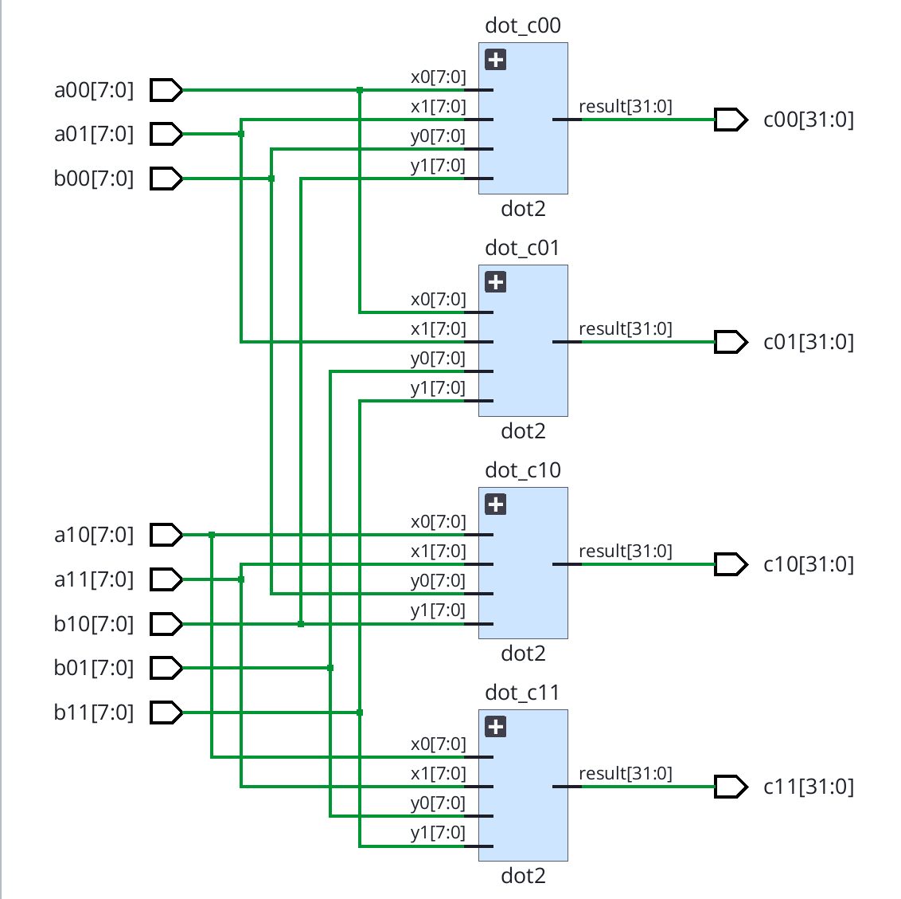
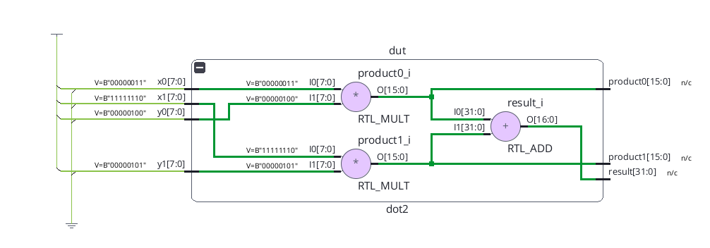

# TinyMAC

### A Small Signed Matrix-Multiplication Datapath in Verilog

## Overview

This is an introductory RTL project I built while learning Verilog and
Vivado. It explores the arithmetic datapath behind small
matrix-multiplication workloads used in hardware accelerators. It is not a
complete AI accelerator or a systolic array.

## Motivation

I recently became interested in digital IC design, FPGA/ASIC accelerators,
computer architecture, and hardware-software co-design. I started with a
signed multiplier, a clocked multiply-accumulate (MAC) exercise, and a small
matrix datapath so I could connect Verilog code to simulation, RTL schematics,
and synthesized FPGA resources.

## Architecture

The matrix input is two 2 × 2 matrices of signed 8-bit values. The
combinational `matrix2x2` module instantiates four `dot2` modules in parallel:

```text
c00 = a00*b00 + a01*b10    c01 = a00*b01 + a01*b11
c10 = a10*b00 + a11*b10    c11 = a10*b01 + a11*b11
```

Each `dot2` performs two signed multiplications followed by one addition.
`mul8` is a standalone multiplier exercise using the same arithmetic
operation; `dot2` writes its two multiplications directly, so `mul8` is not
instantiated in the matrix hierarchy. `mac` is a separate, clocked learning
module: when enabled, it adds one signed product to a 32-bit accumulator at
each rising clock edge. It is not part of `matrix2x2`.

## Arithmetic

| Operation | Width |
| --- | --- |
| Input operand | signed 8-bit (INT8) |
| Product | signed 16-bit |
| Sum of two products | signed 17-bit |
| Matrix output | signed 32-bit |

The 17-bit sum accommodates the full range of two signed 8 × 8 products;
`dot2` explicitly sign-extends that sum to its 32-bit output. The wider output
avoids overflow for this fixed two-product dot operation. The clocked MAC
also uses a 32-bit accumulator, but a sufficiently long accumulation can
still overflow; it has no saturation logic.

## Functional Verification

The self-checking Verilog testbenches cover a positive multiplier case, signed
products, MAC reset and enable behavior, a signed dot product, and matrix
multiplication with positive, negative, and width-boundary operands. Each
testbench prints `PASS` or `FAIL` and calls `$finish`.

For example:

```text
A = [1 2]    B = [5 6]    C = [19 22]
    [3 4]        [7 8]        [43 50]
```

The signed dot-product case checks `3*4 + (-2)*5 = 2`. A width-boundary case
checks that `(-128)*(-128) + (-128)*(-128) = 32768` is retained.

With Vivado 2026.1 installed, generate the project and run all four tests
with the commands in [the Vivado instructions](vivado/README.md). The script
checks each PASS/FAIL result. `matrix2x2_tb` is also the default top for
Behavioral Simulation in the Vivado GUI.

## RTL Structure

Vivado's elaborated RTL view shows the four parallel `dot2` instances in
`matrix2x2`:



Inside one `dot2`, two `RTL_MULT` blocks feed one `RTL_ADD` block:



## Synthesis Results

Target: Xilinx Artix-7 XC7A200T (`xc7a200tfbg676-2`). Tool: Vivado 2026.1.
The following figures were reproduced by synthesizing this repository's
`matrix2x2` top. They are synthesis utilization, not performance benchmarks.

| Resource | Used |
| --- | ---: |
| Slice LUTs | 544 |
| Slice registers (FF) | 0 |
| DSP | 0 |
| Block RAM | 0 |
| CARRY4 | 116 |
| Bonded IOB | 192 |

There are no flip-flops in the synthesized `matrix2x2` top because its
datapath is purely combinational; the separate clocked `mac` module is not
instantiated there. Under this synthesis configuration, the eight 8 × 8
multiplications mapped to LUT and carry logic rather than DSP blocks. This is
a mapping observation, not an efficiency claim.

The top-level matrix ports expose 8 × 8 = 64 input bits and 4 × 32 = 128
output bits, giving 192 I/O bits. This direct interface is convenient for
learning but is not a practical accelerator input method. Larger systems
typically need memory or streaming interfaces such as BRAM, FIFO, AXI, or
DDR. No maximum frequency, latency, power, or board result is claimed here.

## What I Learned

I learned to distinguish combinational matrix logic from a clock-driven MAC,
and to pay attention to signed two's-complement values and width growth in
Verilog. Building the hierarchy helped me see that four instantiated dot
units represent parallel hardware, unlike four steps in a software loop. I
became familiar with reading Vivado's elaborated RTL and synthesis reports.
This project also helped me understand why a useful accelerator needs a data
movement and memory design in addition to arithmetic units.

## Limitations

- Only 2 × 2 matrices with fixed signed 8-bit inputs.
- Purely combinational matrix datapath, without a pipeline.
- No memory subsystem, AXI/streaming interface, or systolic dataflow.
- No physical timing or performance evaluation.
- No board-level implementation or measurement.

## Possible Next Steps

- Add a pipeline and compare area with timing results.
- Reuse one sequential MAC across operations and compare area/latency.
- Try a small systolic dataflow as a separate exercise.
- Experiment with DSP inference settings.
- Add BRAM or a simple streaming input interface.
